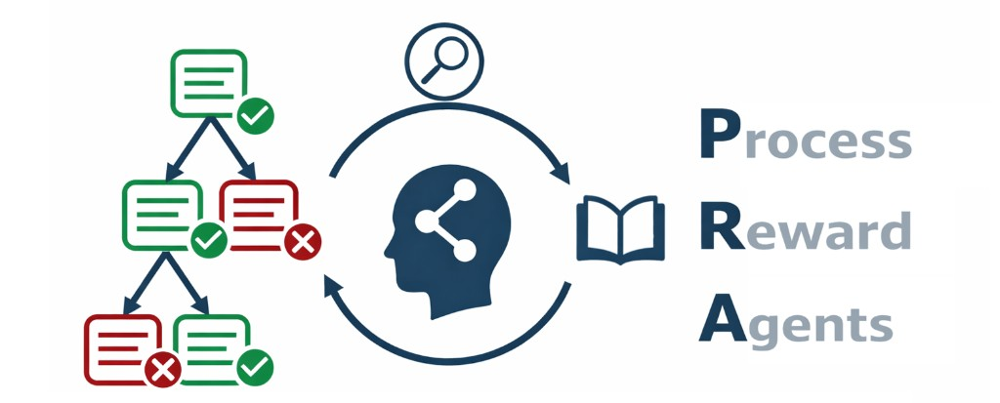

<p align="center">
  
</p>

# Process Reward Agents for Steering Knowledge-Intensive Reasoning

<p align="center">
  <a href="https://process-reward-agents.github.io/" target="_blank"></a>
  <a href="https://huggingface.co/process-reward-agents" target="_blank"></a>
  <a href="https://huggingface.co/process-reward-agents" target="_blank"></a>
  <a href="https://github.com/eth-medical-ai-lab/pra" target="_blank"></a>
</p>

### News

* **[2026]** We release **Process Reward Agents**. Code will be released soon.

### Citation

```bibtex
@article{sohn2026processrewardagents,
  title={Process Reward Agents for Steering Knowledge-Intensive Reasoning},
  author={Jiwoong Sohn and Tomasz Sternal and Kenneth Styppa and Torsten Hoefler and Michael Moor},
  author+an = {1=first; 2=first; 3=first; 4=last; 5=last},
  year={2026},
  url={https://process-reward-agents.github.io/}
}
```
